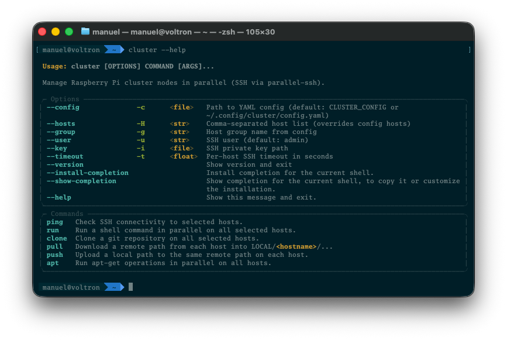

# Cluster CLI



Laptop-side tool to run commands, apt operations, git clones, and file transfers
across the Raspberry Pi nodes in parallel (via [parallel-ssh](https://parallel-ssh.org/)).

## Setup

```bash
# From the repo root (uses the existing uv project / .venv)
uv sync

# Optional: install the `cluster` command on your PATH
uv tool install -e .

# Optional: copy and edit inventory
mkdir -p ~/.config/cluster
cp cluster.example.yaml ~/.config/cluster/config.yaml
```

On macOS, Homebrew `libssh2` is required for the native parallel-ssh backend:

```bash
brew install libssh2
```

The CLI re-execs with `DYLD_FALLBACK_LIBRARY_PATH` when needed so `ssh2-python` can load it.

## Usage

```bash
cluster ping
cluster run "uptime"
cluster run "df -h" --hosts pi-node1,pi-node2
cluster apt update                 # prompts for sudo password
cluster apt upgrade
cluster apt install htop git
cluster apt install python3-mpi4py
cluster apt remove cowsay
cluster apt autoremove             # unused deps; add --purge for configs
cluster apt clean                  # clear /var/cache/apt/archives
cluster apt autoclean              # remove obsolete cached packages
cluster run --sudo "systemctl status slurmd"
cluster clone https://github.com/org/repo.git /home/user/src/repo --user user
cluster pull /var/log/syslog ./logs/
cluster push ./script.sh /tmp/script.sh
cluster run "cd homelab-chronicles && git pull"
```

Global options (before the subcommand):

| Option | Meaning |
|--------|---------|
| `--config` / `-c` | YAML config path |
| `--hosts` / `-H` | Comma-separated hosts |
| `--group` / `-g` | Group from config |
| `--user` / `-u` | SSH user (default `admin`) |
| `--key` / `-i` | Private key path |
| `--timeout` / `-t` | Per-host SSH timeout |

Config load order: `--config` → `CLUSTER_CONFIG` → `~/.config/cluster/config.yaml` → built-in defaults (`pi-node0`–`3`, user `admin`).

From a laptop, hostnames must resolve (via `/etc/hosts`, mDNS, or SSH config). The example file uses the cluster IPs (`192.168.129.36`–`39`) so you can copy it as-is.

Global options go **before** the subcommand, e.g. `cluster --hosts 192.168.129.37 ping`.

`pull` writes each host under `LOCAL/<hostname>/...`.

### Sudo password

`apt` and `run --sudo` use remote `sudo -S`. If `admin` is not passwordless sudo, the CLI prompts once (hidden input) and sends that password to every selected host:

```bash
cluster apt update              # default: --ask-sudo / -K
cluster apt update --no-ask-sudo  # only works with passwordless sudo
cluster run --sudo "id"
```

Longer term you can enable passwordless sudo for `admin` on the nodes so prompts are unnecessary.
