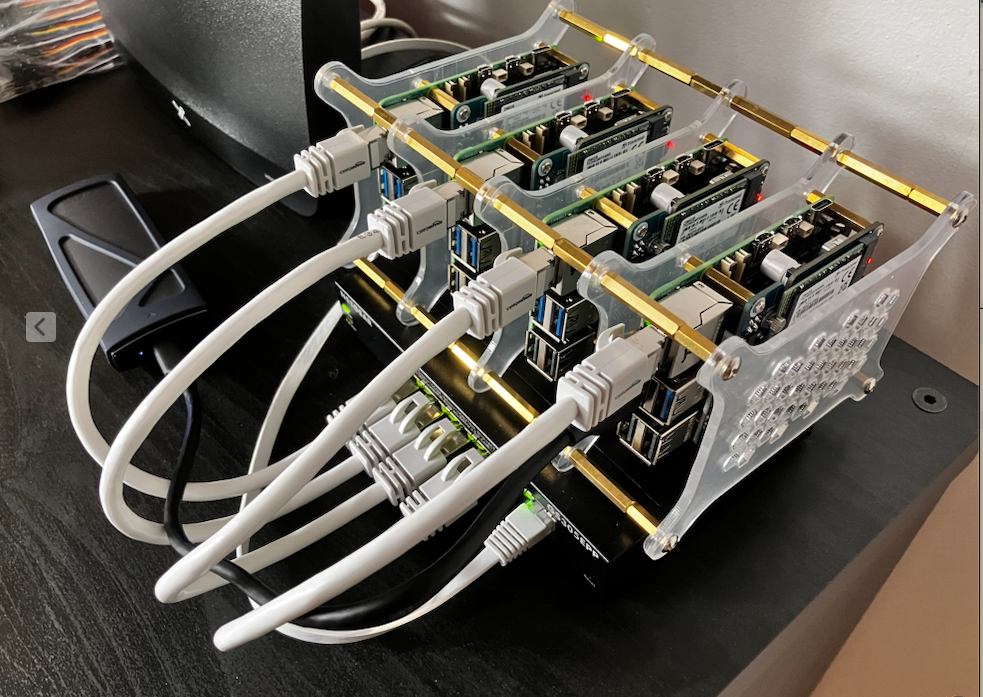

# HOMELAB CHRONICLES
by Manuel A. Diaz on June 15, 2026

This repository serves as a record of documents and scripts (both written by me or generated by AI) used to build, configure and maintain my homelab's infrastructure.

## Contents

- [HOMELAB CHRONICLES](#homelab-chronicles)
  - [Contents](#contents)
  - [Raspberry Pi Cluster](#raspberry-pi-cluster)
  - [Jetson Orin Nano](#jetson-orin-nano)

## Raspberry Pi Cluster

[Raspberry Pi Cluster](./RASPBERRY_PI_CLUSTER.md)

Cluster management CLI (parallel SSH from your laptop): [CLUSTER_CLI.md](./CLUSTER_CLI.md)

## Jetson Orin Nano

[Jetson Orin Nano](./JETSON_ORIN_NANO.md)