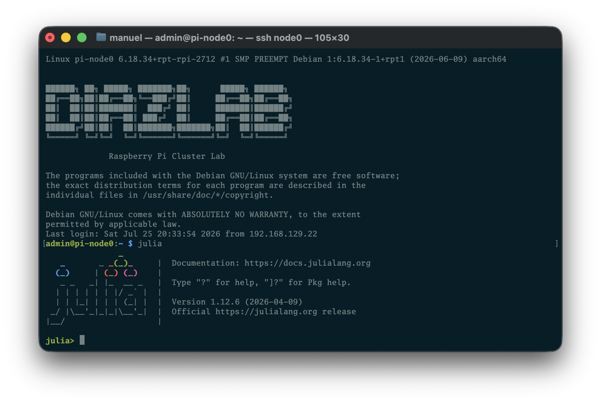

# Install Julia with MPI on the RPi Cluster



Installing Julia on a cluster is a bit more involved than downloading a binary and running it. A few things to keep in mind before you start:

- Do **not** install Julia from the distro package manager (`apt install julia`). That build is usually out of sync with the system OpenMPI.
- You only need to install Julia once. Put it under the shared software directory so every node sees the same binary and packages.
- Precompile `MPI.jl` on the shared depot so compute nodes do not pay the compile cost at job start.

This cluster already has OpenMPI, mpi4py, and SLURM. Shared storage is NFS-mounted on every node at `/mnt/storage/`:

```bash
$ tree -L 2 /mnt/storage/
/mnt/storage/
├── home
│   └── user
├── lost+found
└── shared
    ├── scratch
    └── software
```

Homes live under `/mnt/storage/home/user` (mounted as `/home/user`). Scratch and software live under `/mnt/storage/shared` (mounted as `/shared`). Cluster ops (updates, reboot, health checks) are handled with the [scripts](../scripts/) in this repo.

Assume the cluster is healthy, SLURM and OpenMPI are clean, and mpi4py is installed independently of the system Python. The steps below install Julia and wire it to the existing system OpenMPI.

Run steps 1–4 once as `user` on the head/login node. Step 1’s PATH snippet is the only part that needs repeating on each node.

---


## 1. Download and install Julia

Pick a version from [julialang.org/downloads](https://julialang.org/downloads) (Raspberry Pi 5 needs the **linux aarch64** tarball):

```bash
cd /shared/software
JULIA_VER=1.12.6   # replace with the version you want
wget https://julialang-s3.julialang.org/bin/linux/aarch64/${JULIA_VER%.*}/julia-${JULIA_VER}-linux-aarch64.tar.gz
tar xzf julia-${JULIA_VER}-linux-aarch64.tar.gz
ln -sfn /shared/software/julia-${JULIA_VER} /shared/software/julia
```

Create a shared package depot next to it:

```bash
mkdir -p /shared/software/julia-depot
```

On **each node**, expose Julia and the shared depot via `/etc/profile.d/julia.sh`:

```bash
sudo tee /etc/profile.d/julia.sh >/dev/null <<'EOF'
export PATH=/shared/software/julia/bin:$PATH
export JULIA_DEPOT_PATH=/shared/software/julia-depot
EOF
sudo chmod 644 /etc/profile.d/julia.sh
```

Log out and back in (or `source /etc/profile.d/julia.sh`) so `julia` and `JULIA_DEPOT_PATH` are set. Check with:

```bash
which julia
julia --version
echo "$JULIA_DEPOT_PATH"
```

---


## 2. Point MPI.jl at system OpenMPI

Configure preferences **before** adding or building `MPI`, so the package links against the cluster OpenMPI rather than a bundled one:

```bash
julia -e 'using Pkg; Pkg.add("MPIPreferences")'
julia -e 'using MPIPreferences; MPIPreferences.use_system_binary()'
```

That writes a `LocalPreferences.toml` under the shared depot. Every node will pick it up from NFS. Confirm it found the right library:

```bash
julia -e 'using MPI; println(MPI.identify_implementation())'
```

You should see your system OpenMPI (version and path), not a Julia-bundled MPI.

---


## 3. Install and precompile MPI.jl on the shared depot

Still on the head node, with `JULIA_DEPOT_PATH` pointing at `/shared/software/julia-depot`:

```bash
julia -e 'using Pkg; Pkg.add("MPI"); Pkg.build("MPI"); using MPI'
```

This downloads, builds, and precompiles into the shared depot. Compute nodes will reuse those artifacts over NFS—no per-node compile step.

---


## 4. Minimal MPI hello-world

Write a small test on shared scratch, e.g. `/shared/scratch/mpi_hello.jl`:

```julia
using MPI

MPI.Init()
comm = MPI.COMM_WORLD
rank = MPI.Comm_rank(comm)
size = MPI.Comm_size(comm)
host = gethostname()

println("Hello from rank $rank of $size on $host")
MPI.Barrier(comm)

if rank == 0
    println("All $size ranks checked in.")
end

MPI.Finalize()
```

---


## 5. Submit with SLURM

Mirror the layout of your mpi4py jobs. Example batch script `/shared/scratch/submit_julia_mpi.sh`:

```bash
#!/bin/bash
#SBATCH --job-name=julia-mpi-test
#SBATCH --nodes=4
#SBATCH --ntasks-per-node=4
#SBATCH --time=00:05:00
#SBATCH --output=/shared/scratch/julia-mpi-%j.out

source /etc/profile.d/julia.sh
export OMPI_MCA_btl_tcp_disable_family=6

srun julia /shared/scratch/mpi_hello.jl
```

Submit and inspect:

```bash
sbatch /shared/scratch/submit_julia_mpi.sh
squeue
cat /shared/scratch/julia-mpi-<jobid>.out
```

You should see one line per rank, with hostnames from each node. Output order is not guaranteed by SLURM/OpenMPI, so interleaved lines are fine.

---


## 6. Collective sanity check

Once hello-world works, confirm collectives (not just init) with a short `MPI.Allreduce`:

```julia
using MPI

MPI.Init()
comm = MPI.COMM_WORLD
rank = MPI.Comm_rank(comm)
size = MPI.Comm_size(comm)

local_val = Float64(rank + 1)
total = MPI.Allreduce(local_val, MPI.SUM, comm)
expected = sum(1:size)

if rank == 0
    println("Sum = $total, expected = $expected, match = $(total == expected)")
end

MPI.Finalize()
```

Run it the same way as the hello-world script (shared file + `srun` under SLURM). Rank 0 should report `match = true`.